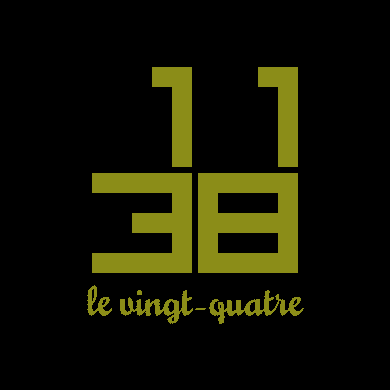

This is a Connect IQ, SDK 7.4.3, Garmin 390x390 watch face that resembles the clock on the Freebox Revolution, the wifi box for Free internet service in France, invented by French industrial designer Philippe Starck. 
https://www.freenews.fr/freenews-edition-nationale-299/freebox-9/freebox-revolution-un-design-atypique-par-starck-9536

The time is drawn using 5x5 square numbers and arrays. <b>It is not animated!</b>

It also displays the day of the month number in French words using, ultimately, pngs. The pngs were made in Adobe Illustrator, where I can easily use the Adobe font Mousse Script (font file not available), and exported to png.

1. Custom fonts - not easy! I gave up and made the 31 word sets ^^ as pngs. 
Relevant but not always helpful links 
https://developer.garmin.com/connect-iq/core-topics/resources/#fonts

I downloaded the OTF->.fnt converter and was impatient and couldn't figure it out 
https://developer.garmin.com/connect-iq/connect-iq-faq/how-do-i-use-custom-fonts/#howdoiusecustomfonts

2. Dynamic loading of one png out of many in a drawables xml - this paragraph from ChatGPT is my experience:
"In the Connect IQ SDK, when you define resources such as PNGs in the resources XML file (like your drawables XML), they are automatically compiled into the Rez class, with each resource accessible via its identifier, such as Rez. Drawables. OnePNG. However, there isn't a built-in method to dynamically access all resources like an iterable container directly from the SDK."
... I did my own workaround (see source/WatchFaceView.mc)

More links 
https://developer.garmin.com/connect-iq/core-topics/layouts/
https://developer.garmin.com/connect-iq/api-docs/Toybox/Graphics.html

The Drawables sample that comes with the SDK and opens nicely in VSC was not helpful. No dynamic png handling examples.

